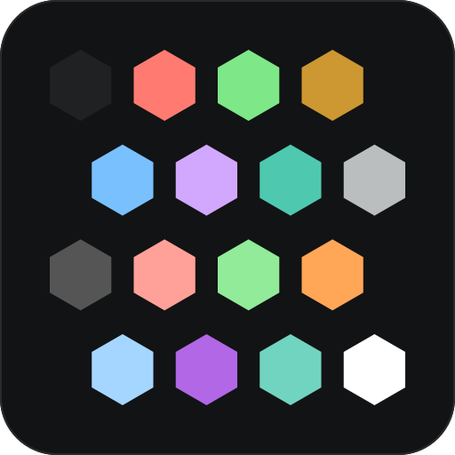

<p align="center">
  
</p>

# dark-2026.nvim

A dark Neovim colorscheme ported from VS Code's **Dark Modern 2026** theme — red keywords,
purple functions, teal types and light-blue strings on a near-black `#121314` canvas.

Based on [D0nw0r/dark2026.nvim](https://github.com/D0nw0r/dark2026.nvim), rebuilt as a
configurable plugin.

## The dark-2026 family

| Target  | Repository                                                            |                |
| ------- | --------------------------------------------------------------------- | -------------- |
| Neovim  | [dark-2026-theme/nvim](https://github.com/dark-2026-theme/nvim)       | **this repo**  |
| Ghostty | [dark-2026-theme/ghostty](https://github.com/dark-2026-theme/ghostty) | terminal theme |
| kitty   | [dark-2026-theme/kitty](https://github.com/dark-2026-theme/kitty)     | terminal theme |
| Xcode   | [dark-2026-theme/xcode](https://github.com/dark-2026-theme/xcode)     | editor theme   |
| Obsidian | [dark-2026-theme/obsidian](https://github.com/dark-2026-theme/obsidian) | app theme    |
| Yazi    | [dark-2026-theme/yazi](https://github.com/dark-2026-theme/yazi)       | file manager |

Every port shares one palette, so `:terminal` inside Neovim renders identically to the host
terminal. See [Matching your terminal](#matching-your-terminal) for the values.

## Features

- **638 highlight groups** — editor UI, legacy syntax, tree-sitter, LSP semantic tokens,
  diagnostics, diffs, and 28 plugins.
- **Transparency** for the editor, with floating windows controlled separately.
- **Per-token styling** — bold/italic/underline for 20 semantic token families.
- **Palette overrides**, static (`palette`) or programmatic (`on_colors`).
- **Highlight overrides**, static (`highlights`) or programmatic (`on_highlights`).
- **Per-plugin opt-out** for every plugin integration.
- Terminal colors (`vim.g.terminal_color_*`) and a **lualine** theme.
- No dependencies. Config errors warn instead of breaking your session.

## Requirements

- Neovim 0.9+
- A true-color terminal (`'termguicolors'` is set by the theme)

## Installation

<details open>
<summary><b>vim.pack (Neovim 0.12+)</b></summary>

In `init.lua`:

```lua
vim.pack.add {
  { src = 'https://github.com/dark-2026-theme/nvim', name = 'dark-2026' },
}

require('dark-2026').setup {}
vim.cmd.colorscheme 'dark-2026'
```

`name` matters here: the repository is `dark-2026-theme/nvim`, and `vim.pack` names the
plugin directory after the repository, so without it the theme would be installed as
`nvim`.

No `priority` or `lazy` equivalent is needed — `vim.pack.add()` installs (on first run) and
adds to `'runtimepath'` synchronously, so the plugin is usable on the next line.

To follow a branch, tag or commit instead of the default branch:

```lua
vim.pack.add {
  {
    src = 'https://github.com/dark-2026-theme/nvim',
    name = 'dark-2026',
    version = 'main',                     -- branch, tag, or commit hash
    -- version = vim.version.range('1.0'), -- or the greatest matching semver tag
  },
}
```

Then:

- `:lua vim.pack.update()` — fetch updates and open a confirmation buffer; `:write` to
  apply, `:quit` to discard.
- `:lua vim.pack.del({ 'dark-2026' })` — uninstall, after removing the spec from `init.lua`.

See `:help vim.pack` for the rest.

</details>

<details>
<summary><b>lazy.nvim</b></summary>

```lua
{
  'dark-2026-theme/nvim',
  name = 'dark-2026',
  lazy = false,
  priority = 1000,
  opts = {},
  config = function(_, opts)
    require('dark-2026').setup(opts)
    vim.cmd.colorscheme 'dark-2026'
  end,
}
```

</details>

<details>
<summary><b>packer.nvim</b></summary>

```lua
use {
  'dark-2026-theme/nvim',
  as = 'dark-2026',
  config = function()
    require('dark-2026').setup {}
    vim.cmd.colorscheme 'dark-2026'
  end,
}
```

</details>

`setup()` is optional — `:colorscheme dark-2026` alone gives you the defaults. Call `setup()`
only when you want to change something, and always **before** the `colorscheme` command
(calling it afterwards reapplies the theme, which also works).

## Configuration

The complete set of options, with defaults:

```lua
require('dark-2026').setup {
  transparent = false,      -- clear the editor background
  terminal_colors = true,   -- set vim.g.terminal_color_0..15
  dim_inactive = false,     -- darken unfocused windows (NormalNC)

  styles = {
    comments = { italic = true },
    keywords = {},
    conditionals = {},
    functions = {},
    methods = {},
    variables = {},
    builtins = { italic = true },
    parameters = {},
    properties = {},
    types = {},
    strings = {},
    numbers = {},
    booleans = {},
    constants = {},
    operators = {},
    namespaces = {},
    macros = {},
    attributes = {},
    tags = {},
    headings = { bold = true },

    floats = 'solid',       -- 'solid' | 'transparent' | 'auto'
  },

  palette = {},                                        -- static color overrides
  on_colors = function(colors) end,                    -- programmatic color overrides
  highlights = {},                                     -- static highlight overrides
  on_highlights = function(highlights, colors) end,    -- programmatic highlight overrides
  plugins = {},                                        -- e.g. { telescope = false }
}
```

Unknown option names and invalid `styles.floats` values produce a warning and are ignored —
a typo will never leave you without a colorscheme.

---

### `transparent`

Clears the background of `Normal`, `NormalNC`, the sign column, line numbers, fold column,
statusline, tabline, winbar and diagnostic virtual text, letting your terminal background
through.

```lua
require('dark-2026').setup { transparent = true }
```

Floating windows are **not** affected — see [`styles.floats`](#stylesfloats).

### `styles.floats`

| Value                 | Effect                                                         |
| --------------------- | -------------------------------------------------------------- |
| `'solid'` _(default)_ | Floats, popups and completion menus always painted (`#202122`) |
| `'transparent'`       | Floats never painted                                           |
| `'auto'`              | Follows `transparent`                                          |

Keeping this at `'solid'` with `transparent = true` gives you a see-through editor with
readable popups, which is usually what you want:

```lua
require('dark-2026').setup {
  transparent = true,
  styles = { floats = 'solid' },
}
```

Affects `NormalFloat`, `FloatBorder`, `FloatTitle`, `Pmenu*`, and the float-based groups of
every plugin integration (telescope, blink.cmp, noice, lazy, mason, …).

### `terminal_colors`

Sets `vim.g.terminal_color_0` … `vim.g.terminal_color_15` so `:terminal` buffers use the
theme's ANSI palette. Set to `false` to leave them alone. See
[Matching your terminal](#matching-your-terminal) for the same values in Ghostty/kitty form.

### `dim_inactive`

Paints unfocused windows (`NormalNC`) with `bg_inactive`, a darkened `bg`. Ignored when
`transparent = true`.

### `styles.<token>`

Every entry is an [`nvim_set_hl()`](<https://neovim.io/doc/user/api.html#nvim_set_hl()>) attribute
table merged into the highlight specs of that token family. Add an attribute with `true`,
remove one the theme sets with `false`:

```lua
require('dark-2026').setup {
  styles = {
    comments = { italic = false },   -- drop the default italic
    keywords = { italic = true },
    functions = { bold = true },
    types = { italic = true },
    parameters = { italic = true },
    headings = { bold = true, underline = true },
  },
}
```

Usable attributes: `bold`, `italic`, `underline`, `undercurl`, `underdouble`, `underdotted`,
`underdashed`, `strikethrough`, `reverse`, `nocombine`.

| Key            | Default             | Applies to (plus every group linked to these)                                                             |
| -------------- | ------------------- | --------------------------------------------------------------------------------------------------------- |
| `comments`     | `{ italic = true }` | `Comment`, `SpecialComment`, `@comment*`, `@markup.quote`                                                 |
| `keywords`     | —                   | `Keyword`, `Statement`, `Label`, `StorageClass`, `PreProc`, `Include`, `Define`, `PreCondit`, `@keyword*` |
| `conditionals` | —                   | `Conditional`, `Repeat`, `Exception`, `@keyword.return`, `@keyword.conditional`, `@keyword.repeat`        |
| `functions`    | —                   | `Function`, `@function`, `@function.call`, `@function.builtin`                                            |
| `methods`      | —                   | `@function.method`, `@function.method.call`, `@lsp.type.method`                                           |
| `variables`    | —                   | `Identifier`, `@variable`, `@variable.builtin`                                                            |
| `builtins`     | `{ italic = true }` | `@variable.builtin`, `@function.builtin`, `@type.builtin`, `@module.builtin`, `@attribute.builtin`        |
| `parameters`   | —                   | `@variable.parameter`, `@lsp.type.parameter`                                                              |
| `properties`   | —                   | `@property`, `@field`, `@variable.member`, `@lsp.type.property`                                           |
| `types`        | —                   | `Type`, `Structure`, `Typedef`, `@type*`, `@constructor`, `@lsp.type.class/enum/interface/struct`         |
| `strings`      | —                   | `String`, `Character`, `@string*`, `@string.escape`, `@string.regexp`                                     |
| `numbers`      | —                   | `Number`, `Float`, `@number`, `@number.float`                                                             |
| `booleans`     | —                   | `Boolean`, `@boolean`                                                                                     |
| `constants`    | —                   | `Constant`, `@constant*`, `@lsp.type.enumMember`, `@lsp.type.const`, readonly variables                   |
| `operators`    | —                   | `Operator`, `@operator`, `@lsp.type.operator`                                                             |
| `namespaces`   | —                   | `@module`, `@namespace`, `@lsp.type.namespace`                                                            |
| `macros`       | —                   | `Macro`, `@function.macro`, `@constant.macro`, `@lsp.type.macro`                                          |
| `attributes`   | —                   | `@attribute`, `@tag.attribute`, `@lsp.type.decorator`                                                     |
| `tags`         | —                   | `Tag`, `@tag`, `@tag.builtin`                                                                             |
| `headings`     | `{ bold = true }`   | `@markup.heading` and `@markup.heading.1` … `.6`                                                          |

### `palette`

Static color overrides, applied on top of the base palette before anything is derived:

```lua
require('dark-2026').setup {
  palette = {
    bg = '#0d0e0f',
    keyword = '#f97583',
    func = '#c9a0ff',
    comment = '#7d8590',
  },
}
```

<details>
<summary><b>All palette keys</b></summary>

**Backgrounds**

| Key          | Value     | Used for                       |
| ------------ | --------- | ------------------------------ |
| `bg`         | `#121314` | editor background              |
| `bg_alt`     | `#191a1b` | statusline, tabline, panels    |
| `bg_menu`    | `#202122` | floats, popups, completion     |
| `bg_line`    | `#242526` | cursorline, folds, inlay hints |
| `bg_widget`  | `#262728` | LSP references, illuminate     |
| `bg_select`  | `#276782` | visual selection               |
| `bg_match`   | `#1e4252` | search matches                 |
| `border`     | `#2a2b2c` | window separators              |
| `border_alt` | `#333536` | float borders                  |

**Foregrounds**

| Key        | Value     | Used for                   |
| ---------- | --------- | -------------------------- |
| `fg`       | `#bbbebf` | default text               |
| `fg_alt`   | `#bfbfbf` | emphasized text            |
| `fg_dim`   | `#8c8c8c` | secondary text             |
| `fg_muted` | `#555555` | line numbers, whitespace   |
| `white`    | `#ffffff` | text on accent backgrounds |

**Accent**

| Key          | Value     |
| ------------ | --------- |
| `accent`     | `#3994bc` |
| `accent_dim` | `#297aa0` |
| `accent_alt` | `#48a0c7` |

**Syntax**

| Key        | Value     | Key          | Value     |
| ---------- | --------- | ------------ | --------- |
| `comment`  | `#8b949e` | `annotation` | `#ffa657` |
| `string`   | `#a5d6ff` | `param`      | `#ffa657` |
| `regex`    | `#7ee787` | `member`     | `#79c0ff` |
| `number`   | `#79c0ff` | `tag`        | `#7ee787` |
| `keyword`  | `#ff7b72` | `attr`       | `#79c0ff` |
| `func`     | `#d2a8ff` | `module`     | `#4ec9b0` |
| `type`     | `#4ec9b0` | `macro`      | `#48a0c7` |
| `variable` | `#bbbebf` | `operator`   | `#ff7b72` |
| `constant` | `#79c0ff` | `preproc`    | `#ff7b72` |

**Diagnostics & diff**

| Key     | Value     | Key           | Value     |
| ------- | --------- | ------------- | --------- |
| `err`   | `#f44747` | `diff_add`    | `#1b3a1b` |
| `warn`  | `#cd9731` | `diff_add_fg` | `#7ee787` |
| `info`  | `#6796e6` | `diff_del`    | `#3a1b1b` |
| `hint`  | `#3a94bc` | `diff_del_fg` | `#ffa198` |
| `ok`    | `#7ee787` | `diff_chg`    | `#2a2a4a` |
| `debug` | `#b267e6` | `diff_chg_fg` | `#79c0ff` |
|         |           | `diff_text`   | `#3a3a63` |

**Derived** — computed from the above after `palette` is applied, so they follow your
overrides. Set them explicitly in `palette` to opt out of the derivation.

| Key                                    | Derivation                                         |
| -------------------------------------- | -------------------------------------------------- |
| `bg_normal`                            | `NONE` when `transparent`, else `bg`               |
| `bg_panel`                             | `NONE` when `transparent`, else `bg_alt`           |
| `bg_float`                             | `NONE` when floats are transparent, else `bg_menu` |
| `bg_inactive`                          | `bg` darkened 35% (used by `dim_inactive`)         |
| `err_bg` `warn_bg` `info_bg` `hint_bg` | diagnostic color blended 12% onto `bg`             |
| `terminal`                             | table of the 16 ANSI colors                        |

</details>

### `on_colors(colors)`

Runs after `palette`, with the whole resolved palette — including the derived keys. Mutate
it in place:

```lua
local util = require 'dark-2026.util'

require('dark-2026').setup {
  on_colors = function(colors)
    colors.comment = util.lighten(colors.comment, 0.15)  -- brighter comments
    colors.bg_float = colors.bg                          -- floats share the editor bg
    colors.terminal[1] = '#ff5555'                       -- custom ANSI red
  end,
}
```

`util` exposes `blend(fg, bg, alpha)`, `darken(hex, amount)`, `lighten(hex, amount)`,
`hex_to_rgb` and `rgb_to_hex`.

### `highlights`

Static highlight-group overrides, merged **last** — after the theme and after
`on_highlights`:

```lua
require('dark-2026').setup {
  highlights = {
    Comment = { fg = '#6f7680' },       -- merged: the theme's italic is kept
    CursorLine = { bg = '#1c1d1e' },
    ['@variable.parameter'] = { fg = '#ffa657', italic = true },
    Visual = { link = 'CursorLine' },   -- a spec with `link` replaces the group outright
  },
}
```

Merge rules: table entries merge key-by-key, so you can change only `fg` and keep the rest.
Pass `italic = false` to clear an attribute. A spec containing `link` replaces the group
completely.

### `on_highlights(highlights, colors)`

Same thing, programmatically, with the palette in hand. Receives the fully built highlight
table before `highlights` is merged on top:

```lua
require('dark-2026').setup {
  on_highlights = function(hl, colors)
    hl.LineNr = { fg = colors.fg_dim }
    hl.WinSeparator = { fg = colors.accent_dim }
    hl.CursorLineNr = { fg = colors.accent, bold = true }
    hl.MyPluginTitle = { fg = colors.accent, bold = true }  -- new groups are fine too
  end,
}
```

### `plugins`

All plugin integrations are on by default. Disable any of them by key — the theme then
leaves those groups untouched, so the plugin's own defaults (or your config) apply:

```lua
require('dark-2026').setup {
  plugins = { bufferline = false, dap = false },
}
```

| Key          | Plugin                                            | Key                  | Plugin                                                          |
| ------------ | ------------------------------------------------- | -------------------- | --------------------------------------------------------------- |
| `gitsigns`   | gitsigns.nvim                                     | `neo_tree`           | neo-tree.nvim                                                   |
| `telescope`  | telescope.nvim                                    | `nvim_tree`          | nvim-tree.lua                                                   |
| `fzf_lua`    | fzf-lua                                           | `oil`                | oil.nvim                                                        |
| `snacks`     | snacks.nvim (picker, notifier, dashboard, indent) | `indent_blankline`   | indent-blankline.nvim                                           |
| `blink`      | blink.cmp                                         | `mini`               | mini.nvim (statusline, tabline, pick, files, diff, indentscope) |
| `cmp`        | nvim-cmp                                          | `lazy`               | lazy.nvim                                                       |
| `bufferline` | bufferline.nvim                                   | `mason`              | mason.nvim                                                      |
| `which_key`  | which-key.nvim                                    | `trouble`            | trouble.nvim                                                    |
| `notify`     | nvim-notify                                       | `flash`              | flash.nvim                                                      |
| `noice`      | noice.nvim                                        | `illuminate`         | vim-illuminate                                                  |
| `dashboard`  | dashboard-nvim, alpha-nvim                        | `treesitter_context` | nvim-treesitter-context                                         |
| `yanky`      | yanky.nvim                                        | `rainbow`            | rainbow-delimiters.nvim                                         |
| `fidget`     | fidget.nvim                                       | `dap`                | nvim-dap, nvim-dap-ui                                           |
| `markdown`   | render-markdown.nvim                              | `navic`              | nvim-navic                                                      |

## lualine

```lua
require('lualine').setup { options = { theme = 'dark-2026' } }
```

The theme reads the resolved palette, so it follows your `palette` / `on_colors` overrides.

## API

```lua
local dark = require 'dark-2026'

dark.setup(opts)        -- store config; reapplies the theme if it is already active
dark.load(opts)         -- apply the colorscheme; opts override the stored config for this call
dark.colors(opts)       -- resolved palette table
dark.highlights(opts)   -- resolved highlight table + palette, without applying them
```

`dark.colors()` is handy for statuslines and other plugins that need to match:

```lua
local c = require('dark-2026').colors()
vim.api.nvim_set_hl(0, 'MyGroup', { fg = c.accent, bg = c.bg_alt })
```

## Matching your terminal

The ANSI palette used for `:terminal` and exported via `vim.g.terminal_color_*`:

|         | Normal    |                | Bright    |
| ------- | --------- | -------------- | --------- |
| black   | `#202122` | bright black   | `#555555` |
| red     | `#ff7b72` | bright red     | `#ffa198` |
| green   | `#7ee787` | bright green   | `#91eb99` |
| yellow  | `#cd9731` | bright yellow  | `#ffa657` |
| blue    | `#79c0ff` | bright blue    | `#a5d6ff` |
| magenta | `#d2a8ff` | bright magenta | `#b267e6` |
| cyan    | `#4ec9b0` | bright cyan    | `#71d4c0` |
| white   | `#bbbebf` | bright white   | `#ffffff` |

With `background #121314`, `foreground #bbbebf`, cursor `#bbbebf`, selection `#276782` on
`#ffffff`. Ready-made theme files:
[Ghostty](https://github.com/dark-2026-theme/ghostty) ·
[kitty](https://github.com/dark-2026-theme/kitty).

<details>
<summary><b>Ghostty</b></summary>

```conf
background = #121314
foreground = #bbbebf
cursor-color = #bbbebf
cursor-text = #121314
selection-background = #276782
selection-foreground = #ffffff

palette = 0=#202122
palette = 1=#ff7b72
palette = 2=#7ee787
palette = 3=#cd9731
palette = 4=#79c0ff
palette = 5=#d2a8ff
palette = 6=#4ec9b0
palette = 7=#bbbebf
palette = 8=#555555
palette = 9=#ffa198
palette = 10=#91eb99
palette = 11=#ffa657
palette = 12=#a5d6ff
palette = 13=#b267e6
palette = 14=#71d4c0
palette = 15=#ffffff
```

</details>

<details>
<summary><b>kitty</b></summary>

```conf
background            #121314
foreground            #bbbebf
cursor                #bbbebf
cursor_text_color     #121314
selection_background  #276782
selection_foreground  #ffffff
url_color             #48a0c7

color0  #202122
color8  #555555
color1  #ff7b72
color9  #ffa198
color2  #7ee787
color10 #91eb99
color3  #cd9731
color11 #ffa657
color4  #79c0ff
color12 #a5d6ff
color5  #d2a8ff
color13 #b267e6
color6  #4ec9b0
color14 #71d4c0
color7  #bbbebf
color15 #ffffff
```

</details>

## Recipes

<details open>
<summary><b>Transparent editor, solid popups, italic keywords</b></summary>

```lua
require('dark-2026').setup {
  transparent = true,
  styles = {
    floats = 'solid',
    keywords = { italic = true },
    comments = { italic = true },
  },
}
```

</details>

<details>
<summary><b>No italics anywhere</b></summary>

```lua
require('dark-2026').setup {
  styles = {
    comments = { italic = false },
    builtins = { italic = false },
  },
}
```

</details>

<details>
<summary><b>Darker background, flatter UI</b></summary>

```lua
require('dark-2026').setup {
  palette = { bg = '#0b0c0d', bg_alt = '#0b0c0d', bg_menu = '#141516' },
  on_highlights = function(hl, c)
    hl.WinSeparator = { fg = c.bg_line }
    hl.SignColumn = { bg = c.bg_normal }
  end,
}
```

</details>

<details>
<summary><b>Reuse the palette in your own config</b></summary>

```lua
local c = require('dark-2026').colors()

require('lualine').setup {
  options = { theme = 'dark-2026' },
  sections = { lualine_c = { { 'filename', color = { fg = c.accent_alt } } } },
}
```

</details>

## Structure

```
colors/dark-2026.lua              :colorscheme entry point
lua/dark-2026/init.lua            setup / load / colors / highlights
lua/dark-2026/config.lua          defaults and validation
lua/dark-2026/palette.lua         base palette and derived colors
lua/dark-2026/theme.lua           group assembly and override pipeline
lua/dark-2026/util.lua            color math and merge helpers
lua/dark-2026/groups/             editor, syntax, treesitter, lsp, plugins
lua/lualine/themes/dark-2026.lua  lualine theme
doc/dark-2026.txt                 :help dark-2026
```

Override precedence, in order: base palette → `palette` → derived colors → `on_colors` →
highlight groups → `on_highlights` → `highlights`.

## Credits

- [D0nw0r/dark2026.nvim](https://github.com/D0nw0r/dark2026.nvim) by D0nw0r — the original
  port this is built on. Licensed MIT; its copyright notice is retained in [LICENSE](LICENSE).
- Microsoft's VS Code **Dark Modern 2026** theme — the source palette.

## License

[MIT](LICENSE)
